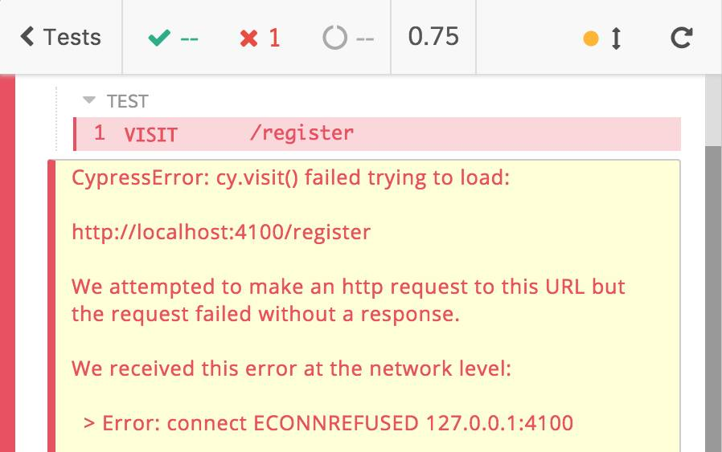
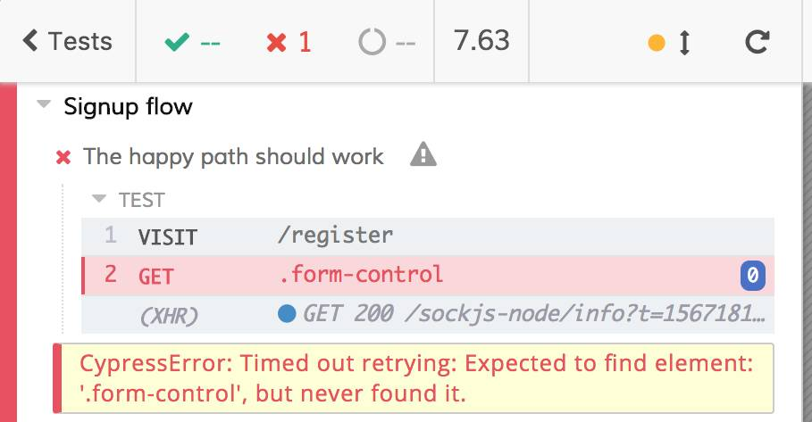
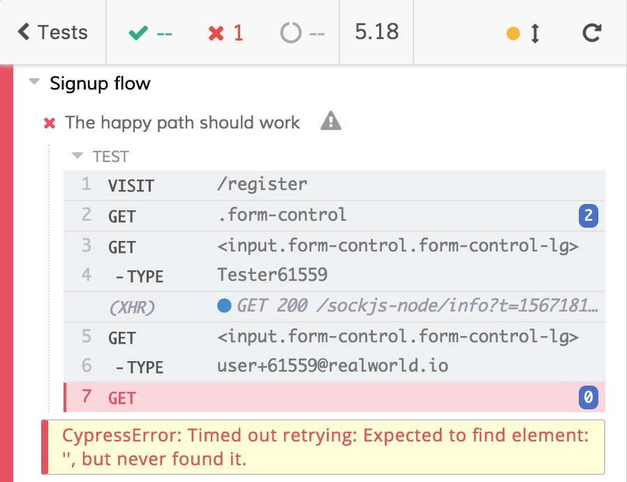
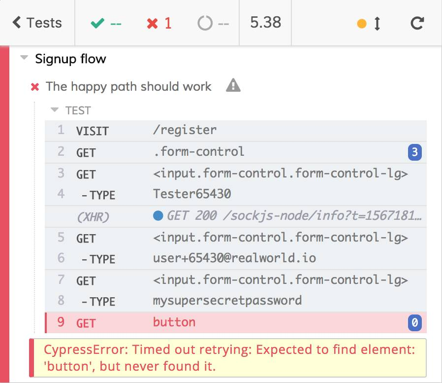
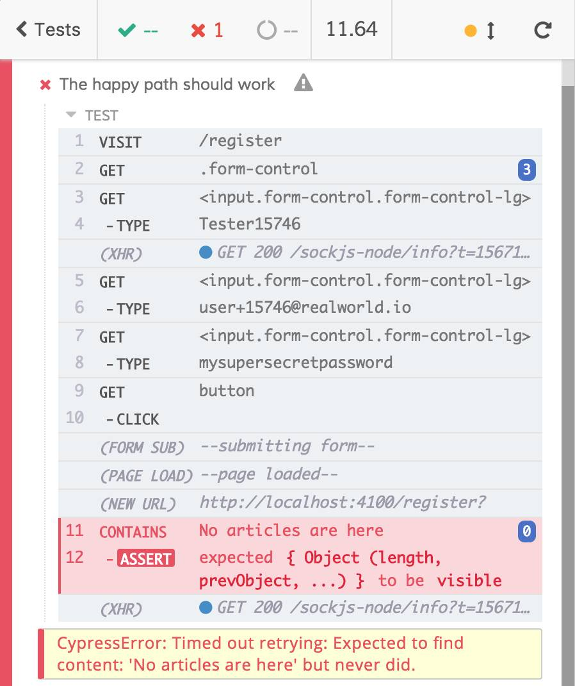

Main E2E test defects

# Utility in case of failure

Last but not least, another big defect of the written test is that it's useless when it fails. The are tens of reasons that could make the test (or, better, the signup flow) fail, we try to list some of them:

1. the host does not work
2. the page does not respond
3. one of the input fields is not rendered
4. the button is not rendered
5. the button does not trigger the right Redux action
6. the AJAX call does not start
7. the AJAX call has the wrong request payload
8. the API does not work and it does not respond
9. the API returns the wrong payload
10. the functions that manage the authentication do not the expected job
11. the user already exists
12. everything is managed correctly but the redirect to the home does not work
13. the home page does not show the "_No articles are here_" text
14. the home page shows a slight different message to the user, something like, "_Click on 'New Post' to add your first contribution_"

They are not all the possible ones but it's a starting list.

### Implementation details errors

First of all, we need to remove some of the possible errors since the beginning. The following ones

5. the button does not trigger the right Redux action
6. the functions that manage the authentication do not do the expected job

could be listed in the so-called "_implementation details_". We're testing the whole front-end application from an outer perspective, not from an inner one. **We are testing that** the user signup **works**, **not how** the signup works.

A more practical example: if you need to test that pushing the accelerator get the car move, you push the accelerator and you check that... the car move! If the accelerator is a wired or electronic one does not matter! You will test the connection between the accelerator and the engine with other types of test.

Remember that the subject under test must be treated as a black box (see the [testing rules](testing-rules.md)). About the signup flow: we are not testing why the form component do not receive the right dispatch prop or why it does not call it. We are just checking that the form works and allows the user to register! **Do the users care about Redux actions? No!** They just want to register!

### Error feedback

Imagine this scenario: you're working at a new feature. You have inadvertently broken the signup flow and you discover that as soon as you run the existing E2E tests. Tests can fail, it happens! **Tests are not meant to be always green**, they are meant to help us discover regressions as soon as possible! Apart from failing, what have we broken in the signup flow? Is the test useful to identify what we need to fix?

Take a look at the feedback the Test Runner gives us for all the above-listed errors.

| Error                                                                                                                                                                                                                                                                                                                                                                                                                                                                                                                            | Test Runner feedback                                                        | Is it useful? |
| -------------------------------------------------------------------------------------------------------------------------------------------------------------------------------------------------------------------------------------------------------------------------------------------------------------------------------------------------------------------------------------------------------------------------------------------------------------------------------------------------------------------------------- | --------------------------------------------------------------------------- | ------------- |
| 1. the host does not work                                                                                                                                                                                                                                                                                                                                                                                                                                                                                                        |        | ✅            |
| 2. the page does not respond                                                                                                                                                                                                                                                                                                                                                                                                                                                                                                     |     | ⚠️            |
| 3. one of the input fields is not rendered                                                                                                                                                                                                                                                                                                                                                                                                                                                                                       |   | ❌            |
| 4. the button is not rendered                                                                                                                                                                                                                                                                                                                                                                                                                                                                                                    |  | ✅️           |
| All the remaining errors:  6. the AJAX call does not start  7. the AJAX call has the wrong request payload  8. the API does not work and it does not respond  9. the API returns the wrong payload  11. the user already exists  12. everything is managed correctly but the redirect to the home does not work  13. the home page does not show the "_No articles are here_" text  14. the home page shows a slight different message to the user |     | ❌            |

Take the most useless two errors and inverting the comparison, do you think that the feedback on the first column allows you to understand what happened (the second column)? 🤔

| Test Runner feedback                                                             | Error                                                                                                                                                                                                                                                                                                                                                                                                                                                                                                          |
| -------------------------------------------------------------------------------- | -------------------------------------------------------------------------------------------------------------------------------------------------------------------------------------------------------------------------------------------------------------------------------------------------------------------------------------------------------------------------------------------------------------------------------------------------------------------------------------------------------------- |
|  | 3. one of the input fields is not rendered                                                                                                                                                                                                                                                                                                                                                                                                                                                                     |
|    | One of   6. the AJAX call does not start  7. the AJAX call has the wrong request payload  8. the API does not work and it does not respond  9. the API returns the wrong payload  11. the user already exists  12. everything is managed correctly but the redirect to the home does not work  13. the home page does not show the "_No articles are here_" text  14. the home page shows a slight different message to the user |

The answert is obviously No. The errors in the table tell us nothing about what happened.

### Stuff to do in case of failures

It's not only about utility but also about preventing useless and long debugging processes. How do you proceed when a test fails? Usually you:

- read the logs of the tests

- look for the failing test and read the output error

- it the output speaks for itself you can fix the regression you introduces, otherwise, you open the test file

- identify the failing test and you run only it <!-- TODO: add a link to the page that speaks about the "only" function --> (if you have violated the "tests must not share the state" [rule](testing-rules.md) you are going to waste a lot of time at this step)

- re-run the test looking at the web app

- based on the error

  - if the error is a "visual one" (something not rendered etc.) you know where do you have to check <a href="#footnote1">1</a>
  - If the error is not visual one (wrong DOM selectors, wrong AJAX payloads, etc.) you need to open the DevTools, re-run the test, inspect the DOM or the network activities, etc. until you find the error itself

It's a ton of work! The test we're talking about is not helpful at all! It has no meaningful feedback and it requires you debugging it (remember: debugging a test is harder than debugging a standard script/app) on failure. These are the basis for test blaming, hate and exclusion. Always remember: **if you are blaming the tests, you must stop and re-think them**. Go ahead to re-think the E2E test.

   
Footnotes:

<a id="footnote1">1</a>: for visual errors, a look at the [screenshots and videos that Cypress saves automatically](https://docs.cypress.io/guides/guides/screenshots-and-videos.html#Screenshots) could be enough.
