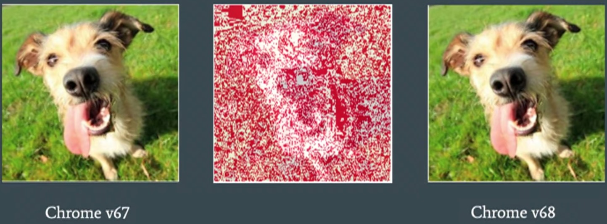

# Visual Regression Testing

The contracts the front-end must adhere are more than one: from a functional contract with the user to a communication contract with the server. Another important aspect is the visual contract. We implement a visual design system and we do our best to get every view conformed with it.

A lot of concerns come from testing the visual aspect of a front-end application. **Pixel-by-pixel comparisons are heavy**, slow and not reliable most of the times, why?

- visual regression tests are obviously based on image comparisons: we need to make a screenshot of "a page" and compare it with the previous screenshot. That's not an easy task, there are tons of NPM modules that do it for us but...

- but they're slow, taking and comparing 50/100 screenshots **could take minutes**

- the confidence they give is relative, a lot of times **they give false negatives**. You usually set a "tolerance" ratio that does not care if, for example, "less than 2% of the pixels are different". Why do you need to set it? Well, take a look at the next image

the image in the center highlights the difference, in terms of changed pixels, between the two images... Just for a browser update...

- the same way we write a lot of different tests, we need to visually test a lot of different tools/pages/views (think about the whole app and every Storybook story for example)

- we need to test a lot of different browsers: if a lot of times the functional (JavaScript) features do not need to be tested on different browsers, we cannot say the same for the visual (CSS) aspect. Different browser render different things, this gets the visual testing harder

It all depends on your needs, there are a lot of manual-triggered solutions (like the [StoryShots addon for Storybook](https://www.npmjs.com/package/@storybook/addon-storyshots) or the [image-snapshot plugin for Cypress](https://github.com/palmerhq/cypress-image-snapshot)) but the suggestion is to leverage professional services like [Percy](https://percy.io) and [Applitools](https://applitools.com). You need to face the limits of non-professional tools so early that it's hard to tell if they worth a try.

Professional and dedicated tools are not free but they simplify your life, they:

- can be integrated into your existing stack

- provide you a nice UI to perform visual testing

- provide cross-browser support

- manage automatically and smartly the little differences to avoid false negatives

- move the workload on their servers instead of your local machine

If you want see how a professional tool could help you with Visual Regression Testing, see the [Writing Tests For CSS Is Possible! Don’t Believe The Rumors](https://www.youtube.com/watch?v=Dl_XMd_1F6E) talk by Gil Tayar.

Author: <a href="about-us.md#stefano-magni">Stefano Magni</a>

